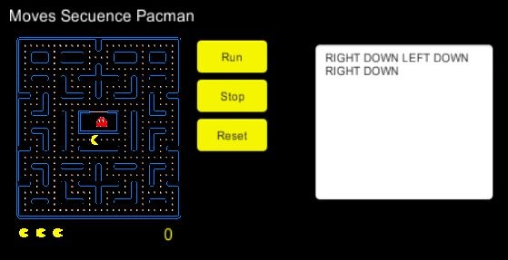
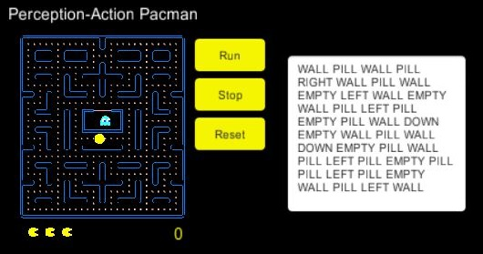
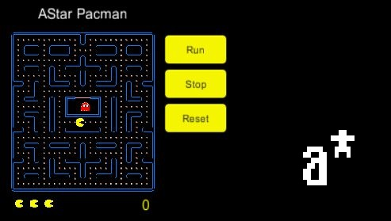
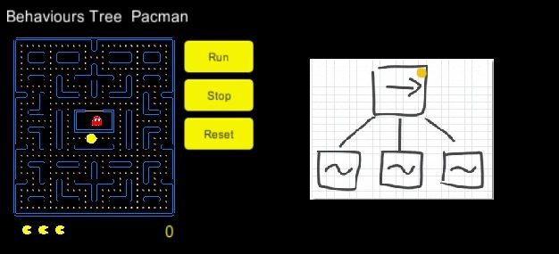

# PACMAN Intelligent Agent

Este proyecto ha sido desarrollado para la asignatura de **Sistemas Inteligentes** del itinerario de computación del **_Grado en Ingeniería Informática_** de la **ULL**.

## MIEMBROS DEL GRUPO
Paz Méndez, Germán  ([alu0100503647@ull.edu.es]())  
Hernández Pérez, Víctor ([alu0100697032@ull.edu.es]())

## INTRODUCCIÓN
En este documento se recogen todos los aspectos  descríptivos de desarrollo e implementación del proyecto final propuesto para la asignatura Sistemas inteligentes, desarrollado
a lo largo de todo el curso.

## DESCRIPCIÓN

Elaboración de un **agente inteligente** para el juego de PacMan utilizando diferentes paradigmas inteligentes.

>   
** PacMan ** es un conocido juego en tiempo real que ofrece una interesante plataforma para la investigación.  

#### **PACMAN basado en una Secuencia de movimientos:**  

Definimos un agente inteligente `PacMan` que intentará resolver el laberinto de una manera pre-programada antes de que se inicie el juego. Para ello le indicaremos una secuencia de movimientos que deberá seguir para completar el nivel.

Se ha dicho que siempre es posible obtener **"una programación bien adquirida"** para conseguir un **"objetivo",** por ello intentamos contemplar este paradigma a traves de la posibilidad de establecer uno movimientos iniciales con los que sabemos que el pacman alcanzará la victoria.

#### **PACMAN basado en una tabla de Percepción-Acción:**

Definimos un agente inteligente `PacMan` de reflejo simple que intentará superar el nivel actuando según lo que encuentre a su alrededor. Para ello utilizaremos una tabla de persepción acción como a continuación:    

| UP | RIGHT | DOWN | LEFT | ACTION |
|:------:|:------:|:------:|:------:|:------:|
| WALL | WALL | WALL | WALL  | **STOP**   |
| WALL | WALL | WALL | PILL  | **LEFT**   |
| WALL | WALL | PILL | WALL  | **DOWN**   |
| WALL | PILL | WALL | WALL  | **RIGHT**   |
| PILL | WALL | WALL | WALL  | **UP**   |
| PILL | PILL | WALL | WALL  | **DOWN**   |
| PILL | PILL | PILL | WALL  | **UP**   |
| PILL | PILL | PILL | PILL  | **RIGHT**   |
| WALL | PILL | PILL | PILL  | **UP**   |
| WALL | WALL | PILL | PILL  | **UP**   |
| WALL | WALL | PILL | PILL  | **UP**   |

Un inconveniente típico de este sistema es que la tabla puede ser enorme y difícil de construir.

####  **PACMAN basado en el algoritmo A*:**

Definimos un agente inteligente `PacMan` que reemplazará al ser humano reproduciendo una simplicada versión deL juego. El único objetivo será perseguir las píldoras. Para ello hará uso del A* para perseguir la más cercana. Además si el fantasma se cruza en la trayectoria del pacman este cambiará la trayectoria.

####  **PACMAN basado en un arbol de comportamiento:**

  

Definimos un agente inteligente `PacMan` que simula un comportamiento simple mediante un árbol de comportamiento.

> En 1999 el jugador **Billy Mitchell realizó una partida perfecta de Pac-Man,** entendiéndose como tal una partida en la que el jugador completo los 255 niveles con la puntuación máxima sin ser capturado ni una sola vez. La puntuación máxima es de 3.333.360 puntos.

Hemos establecido la posibilidad de modificar los diferentes archivos de configuración del agente inteligente Pacman. Con esto podremos determinar la mejor arquitectura para realizar una partida perfecta.

## PROYECTOS SIMILARES
MS. Pacman

#### Wikipedia
 https://es.wikipedia.org/wiki/Pac-Man
#### Proyectos
#### Vídeos
https://www.youtube.com/watch?v=46hjf_x_0VU  
https://www.youtube.com/watch?v=yfsMHtmGDKEm  
https://github.com/MazeSolver/MazeSolver

## RECURSOS
+ C#
+ UNITY
+ BEHAVE
+ Material audiovisual propios del juego original.

## Tecnologías de IA
* Pre-programación.
* Tablas de Persepción-Acción.
* A*.
* Árbol de comportamiento.

## Desarrollo

## Problemas encontrados
A lo largo del proyecto nos hemos topado con diferentes problemas, entre los cuales destacamos:
+ Dificultades con la idea general planteada.
+ Implementación desde 0 del juego Pacman.
+ Aprendizaje de librerias externas.
+ Tiempo limitado.

## POSIBLES MEJORAS
+ Implementación de píldoras de poder.
+ Implementación de varios niveles.
+ Implementación de fantasmas inteligentes.
+ Mejorar los algoritmos para que perciban mejor a los fantasmas.
+ Implementar un árbol de comportamiento más complejo.
+ Añadir los sonidos típicos del juego.

## Funcionamiento
Tenemos un archivo ejecutable para Windows con el cual el usuario lo podrá ejecutar.

## Conclusiones
En líneas generales hemos cumplido el objetivo y hemos llegado a crear un pacman inteligente.
