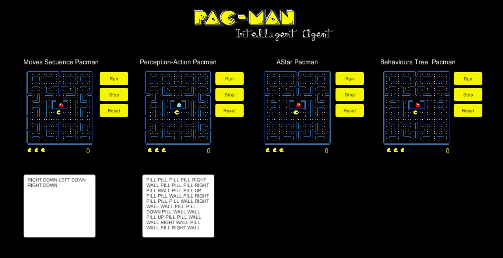

# PACMAN Intelligent Agent

Este proyecto ha sido desarrollado para la asignatura de **Sistemas Inteligentes** del itinerario de computación del **_Grado en Ingeniería Informática_** de la **ULL**.  

> **NOTA:** El README.md será el informe a entregar.

## MIEMBROS DEL GRUPO
Paz Méndez, Germán   
Hernández Pérez, Víctor

## INTRODUCCIÓN
En este documento se recogen todos los aspectos  descríptivos del desarrollo e implementación del proyecto final propuesto para la asignatura Sistemas inteligentes.

## DESCRIPCIÓN

El proyecto ha consistido en la elaboración de varios **agentes inteligentes** para el juego de PacMan utilizando diferentes arquitecturas inteligentes.

> **NOTA:  PacMan ** es un conocido juego en tiempo real que ofrece una interesante plataforma para la investigación y el desarrollo de la IA.  

#### **PACMAN basado en una Secuencia de movimientos:**  

Definimos un agente inteligente `PacMan` que intentará resolver el laberinto de una manera pre-programada antes de que se inicie el juego. Para ello le indicaremos una secuencia de movimientos que deberá seguir para completar el nivel.

Establecemos la posibilidad de que el agente obtenga **"una programación bien adquirida"** para conseguir un **"objetivo perseguido",** por ello intentamos contemplar este paradigma a traves de la posibilidad de establecer unos movimientos iniciales con los que sabemos que el pacman alcanzará la victoria.

#### **PACMAN basado en una tabla de Percepción-Acción:**

Definimos un agente inteligente `PacMan` de reflejo simple que intentará superar el nivel actuando según las percepciones de objetos o fantasmas que encuentre a su alrededor. Para ello utilizaremos una tabla de Percepción-Acción como la siguiente:    

| UP | RIGHT | DOWN | LEFT | PERCEPTION / ACTION |
|:------:|:------:|:------:|:------:|:------:|
| WALL | WALL | WALL | WALL  | **STOP**   |
| WALL | WALL | WALL | PILL  | **LEFT**   |
| WALL | WALL | PILL | WALL  | **DOWN**   |
| WALL | PILL | WALL | WALL  | **RIGHT**   |
| PILL | WALL | WALL | WALL  | **UP**   |
| PILL | PILL | WALL | WALL  | **DOWN**   |
| PILL | PILL | PILL | WALL  | **UP**   |
| PILL | PILL | PILL | PILL  | **RIGHT**   |
| WALL | PILL | PILL | PILL  | **UP**   |
| WALL | WALL | PILL | PILL  | **UP**   |
| WALL | WALL | PILL | PILL  | **UP**   |

> **NOTA:** Un inconveniente típico de este sistema es que la tabla puede ser enorme y difícil de construir si establecemos muchas percepciones posibles, por ello hemos añadido a WALL la percepción de los fantasmas y a PILL los espacios vacíos reduciendo así el tamaño de la misma.

####  **PACMAN basado en el algoritmo A*:**

Definimos un agente inteligente `PacMan` que utilizará el algoritmo de A*, siendo este el más conocido en juegos para encontrar la ruta optima.

> **NOTA:** EL primer juego en utilizar el A* fue el Pacman, aunque en este caso eran los fantasmitas los que lo implementaban.

Por lo tanto el único objetivo del agente será el de perseguir las píldoras. Para ello hará uso del A*. Además si el fantasma se cruza en el camino del pacman este cambiará la trayectoria para no perder alguna de sus tres vidas.

####  **PACMAN basado en un arbol de comportamiento:**

  

Definimos un agente inteligente `PacMan` que simula un comportamiento simple mediante un árbol de comportamiento.

Esta es una de las técnicas que se ha venido utilizando en los últimos años para poder modelar Inteligencia artificial en videojuegos. Cada día ha ido ganando cada vez más adeptos a lo largo de los años.

Como todo lo que es representado por un árbol la visualización de lo que se pretende hacer es bastante sencillo y esto nos permite ganar en tiempo de desarrollo. En nuestro agente hemos añadido un selector y cinco acciones:

  

Con estás cuatro arquitecturas pretendemos obtener la máxima puntuación en el juego del Pacman.

> **NOTA:** En 1999 el jugador **Billy Mitchell realizó una partida perfecta de Pac-Man,** entendiéndose como tal una partida en la que el jugador completo los 255 niveles con la puntuación máxima sin ser capturado ni una sola vez. La puntuación máxima es de 3.333.360 puntos.

Hemos establecido la posibilidad de modificar los diferentes archivos de configuración de varios agentes inteligentes Pacman. Con esto podremos determinar la mejor arquitectura para realizar una partida perfecta.

## PROYECTOS SIMILARES

#### OnLine
+ MS. Pacman ([URL](http://cswww.essex.ac.uk/staff/sml/pacman/PacManContest.html))

#### Vídeos
+ Pacman agent using AI ([URL](https://www.youtube.com/watch?v=46hjf_x_0VU  ))
+ Playing Pacman using AIXI Approximation ([URL](https://www.youtube.com/watch?v=yfsMHtmGDKEm))   
+ Pac-Man played by an AI agent (CS188.1x) ([URL](https://www.youtube.com/watch?v=zHRlCSUe0Q0))

## RECURSOS
A lo largo del proyecto hemos utilizado los siguientes **recursos** para la creación del agente inteligente Pacman:

#### Wikipedia
+ Agente inteligente ([URL](https://en.wikipedia.org/wiki/Intelligent_agent))
+ Pacman ([URL](https://es.wikipedia.org/wiki/Pac-Man))  
+ A\* ([URL](https://en.wikipedia.org/wiki/A*_search_algorithm))    
+ Árbol de comportamiento ([URL](https://en.wikipedia.org/wiki/Behavior_tree_(artificial_intelligence,_robotics_and_control))
+ Tablas de Persepción-Acción
([URL](https://en.wikipedia.org/wiki/Intelligent_agent#Simple_reflex_agents))

#### Lenguajes, plataformas y librerías
+ C# ([URL](https://msdn.microsoft.com/es-es/library/kx37x362.aspx))
+ UNITY ([URL](https://unity3d.com/es))
+ BEHAVE ([URL](https://www.assetstore.unity3d.com/en/#!/content/10912))

#### Material utilizado
  + Sprites 

## TECNOLOGÍAS DE IA
En el proyecto implementamos **varias arquitecturas** de agente de IA:
+ Pre-programación o programación adquirida inicialmente
+ Tablas de Persepción-Acción
+ A*
+ Árbol de comportamiento

## DESARROLLO
#### Lista de tareas y cronograma

## ESTADO ACTUAL
Fase Final. Entregado!

## PROBLEMAS ENCONTRADOS
A lo largo del proyecto nos hemos topado con **diferentes problemas,** entre los cuales destacamos:
+ Dificultades con la idea general planteada en el comienzo.
+ Implementación desde cero del juego Pacman.
+ Aprendizaje de librerias externas.
+ Tiempo limitado.

## POSIBLES MEJORAS
Hemos detectado **varias limitaciones** que corregiremos en un futuro implementándolas:
+ Implementación de píldoras de poder.
+ Implementación de varios niveles.
+ Implementación de fantasmas inteligentes.
+ Mejorar los algoritmos para que Pacman perciba mejor a los fantasmas.
+ Implementar un árbol de comportamiento más complejo.
+ Añadir los sonidos típicos del juego.

## FUNCIONAMIENTO
Tenemos un archivo ejecutable (**test1.EXE**) para Windows con el cual el usuario lo podrá ejecutar.

A traves de este ejecutaremos el programa y dispondremos para cada arquitectura del agente implementada los botones **START, STOP y RESET:**

+ **START:** ejecuta la simulación de la arquitectura planteada.
+ **STOP:** para la simulación de la arquitectura planteada.
+ **RESET:** reinicia la simulación de la arquitectura planteada.

Para las arquitecturas "Moves Secuence Pacman" y "Perseption-Action Pacman" **disponemos de una entrada de datos para su configuración de movimientos** según arquitectura.

Con esto disponemos de las herramientas necesarias para ver las diferentes implementaciones de los agentes programados.

## CONCLUSIONES
En líneas generales hemos cumplido el objetivo y hemos llegado a crear un pacman inteligente mediante las diferentes arquitecturas expuestas en este informe.
